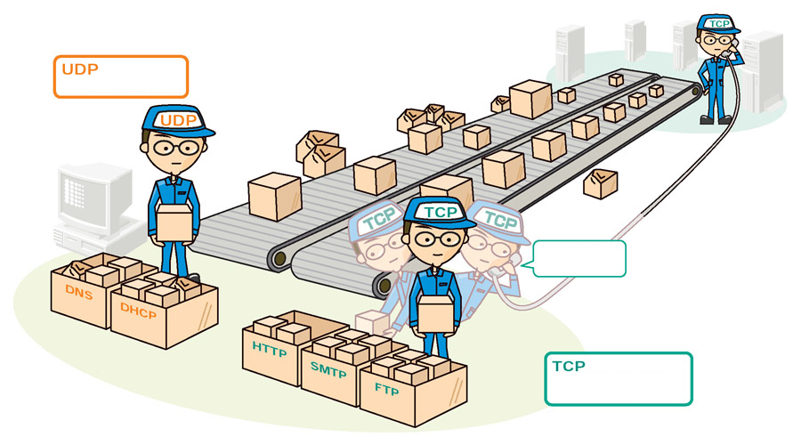

# Networking Basics

This project contains tasks for learning about the basics of networking.

## Tasks To Complete

+ [x] 0\. OSI model  _**[0-OSI_model](0-OSI_model)**_ contains the answers to the following questions:
  + What is the OSI model?
    1. Set of specifications that network hardware manufacturers must respect.
    2. The OSI model is a conceptual model that characterizes the communication functions of a telecommunication system without regard to their underlying internal structure and technology.
    3. The OSI model is a model that characterizes the communication functions of a telecommunication system with a strong regard for their underlying internal structure and technology.
  + How is the OSI model organized?
    1. Alphabetically.
    2. From the lowest to the highest level.
    3. Randomly.
+ [x] 1\. Types of network  _**[1-types_of_network](1-types_of_network)**_ contains the answers to the following questions:
  + What type of network a computer in local is connected to?
    1. Internet.
    2. WAN.
    3. LAN.
  + What type of network could connect an office in one building to another office in a building a few streets away?
    1. Internet.
    2. WAN.
    3. LAN.
  + What network do you use when you browse www.google.com from your smartphone (not connected to the Wifi)?
    1. Internet.
    2. WAN.
    3. LAN.
+ [x] 2\. MAC and IP address  _**[2-MAC_and_IP_address](2-MAC_and_IP_address)**_ contains the answers to the following questions:
  + What is a MAC address?
    1. The name of a network interface.
    2. The unique identifier of a network interface.
    3. A network interface.
  + What is an IP address?
    1. Is to devices connected to a network what postal address is to houses.
    2. The unique identifier of a network interface.
    3. Is a number that network devices use to connect to networks.
+ [x] 3\. UDP and TCP  _**[3-UDP_and_TCP](3-UDP_and_TCP)**_ contains the answers to the following questions, which are used to fill the empty parts in the image below:
  
  + Which statement is correct for the TCP box:
    1. It is a protocol that is transferring data in a slow way but surely.
    2. It is a protocol that is transferring data in a fast way and might loss data along in the process.
  + Which statement is correct for the UDP box:
    1. It is a protocol that is transferring data in a slow way but surely.
    2. It is a protocol that is transferring data in a fast way and might loss data along in the process.
  + Which statement is correct for the TCP worker:
    1. Have you received boxes x, y, z?
    2. May I increase the rate at which I am sending you boxes?
+ [x] 4\. TCP and UDP ports  _**[4-TCP_and_UDP_ports](4-TCP_and_UDP_ports)**_ contains a Bash script that displays listening ports but only shows listening sockets and the PID and name of the program to which each socket belongs.
+ [x] 5\. Is the host on the network  _**[5-is_the_host_on_the_network](5-is_the_host_on_the_network)**_ contains a Bash script that pings an IP address passed as an argument 5 times and displays `Usage: 5-is_the_host_on_the_network {IP_ADDRESS}` if no argument is passed.
