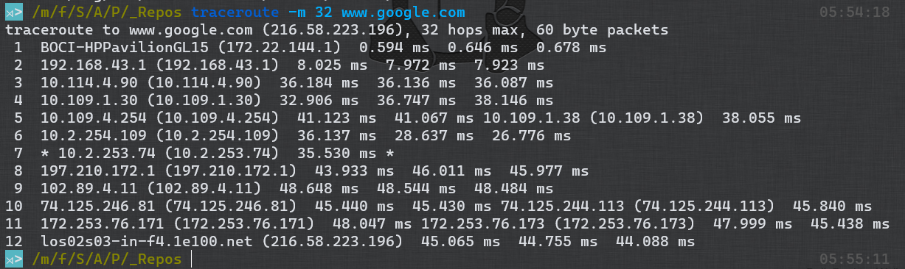

# What happens when you type https://www.google.com into your browser and hit Enter?

With over 80% of the search market share, *Google* is by far the world's largest search engine but have you ever wondered what happens when you type `https://www.google.com` into your browser and hit *Enter*. From a high-level perspective, what happens would look like this:


The flow of the request created when you type https://www.google.com in your browser and press Enter

There seems to be a lot going on there and it's amazing how it takes only a second or two (give or take) for all of that to happen. We need to take a closer look at the diagram above to have a better understanding of what's going on there.

The first thing that happens when you type *https://www.google.com* in the browser and hit Enter is that the browser checks its DNS (Domain Name System) cache to see if it can find the IP (Internet Protocol) address of the hostname (www.google.com). It may also check the operating system DNS cache or any nearby DNS cache because the process has to be really fast. If none of the nearby DNS caches contain the IP address for the hostname, the DNS server at the user's ISP (Internet Service Provider) would have to perform a recursive DNS lookup to find the IP address. This process involves several recursive queries that would lead to the browser receiving the IP address of the server that would handle the request if the DNS lookup was successful.

In order to provide low latency to users, Google has authoritative name servers that would provide the IP address of the closest web service to the user. This is usually based on the user's geolocation and the amount of load at the location of the server. This would mean that DNS-based load balancing occurs before a connection between the user's connection to Google's web search service starts. At the time and place of writing this article, a DNS query for [www.google.com](www.google.com) provided the IP address 216.58.223.196.


DNS lookup for [www.google.com](www.google.com)

After receiving the IP address, the browser would attempt to establish a TCP (Transmission Control Protocol) connection with the server. The browser would later establish an SSL (Secure Sockets Layer) or TLS (Transport Layer Security) connection with the server through an SSL/TLS handshake not only because the URL uses *https* (Hypertext Transfer Protocol Secure), but Google's servers would redirect all *http* (Hypertext Transfer Protocol) requests to *https*. This is a measure taken by Google to ensure that the communication between its servers and the user is kept secure. Google's servers are also protected by a firewall to monitor incoming and outgoing communications.


An overview of SSL/TLS handshake.


The timing of the browser's network operations.

Once a successful connection has been established with the server, the browser would encrypt and send the HTTP request using the HTTP communication rules. The HTTP request would include the request line, several headers, and a body. The request line contains the HTTP method, resource path, and the HTTP version to communicate with. The request line for the HTTP request could look like this:

```http
GET / HTTP/2
```

The headers contain extra information that could help the server identify the client and provide more specific information. Some of the headers that could be sent include the following:

```http
accept: text/html,application/xhtml+xml,application/xml;q=0.9,image/webp,image/apng,*/*;q=0.8,application/signed-exchange;v=b3;q=0.9
accept-encoding: gzip, deflate, br
accept-language: en-US,en;q=0.9
sec-ch-ua-arch: "x86"
sec-ch-ua-bitness: "64"
sec-ch-ua-platform: "Windows"
sec-ch-ua-platform-version: "14.0.0"
sec-fetch-dest: document
sec-fetch-mode: navigate
sec-fetch-site: same-origin
user-agent: Mozilla/5.0 (Windows NT 10.0; Win64; x64) AppleWebKit/537.36 (KHTML, like Gecko) Chrome/97.0.4692.71 Safari/537.36 Edg/97.0.1072.62
```

The body of the HTTP request would be empty (as it should be) because nothing is being submitted to the server by the user.

After sending the request, the browser would have to wait for a response from Google's server(s).

Upon receiving the request, Google's data center router would direct the request to an active Maglev load balancer that is responsible for handling Google's TCP-level load balancing across the frontend servers. The load balancer would then forward it to the appropriate HTTP reverse proxy (Google Front End or GFE).

Google Front End sits between the client and the various Google services like web search, image search, Gmail, etc. The GFE would terminate the client's TCP and SSL sessions and inspect the HTTP header and URL path to determine which backend service should handle the request. After the GFE determines that it should be sent to a web search backend service, it would reencrypt the data and forward the request to the available backend service.

At the backend service, the web server (Google Web Server or GWS) is capable of serving static content such as image, video, and audio files. The application server would be responsible for generating the dynamic web page(s) that depend on the user, the user's location, etc. The application server can also fetch data (like the user's profile picture) from Google's database solution and use the result obtained to generate the dynamic web page.

Google Front End could forward requests to either the application server or the web server. Google Front End could also send each request to the web server, which would make the web server responsible for forwarding requests for dynamic content to the application server.

After the server receives and decrypts the response from Google's frontend server, it would try to display the content received from the server based on the *content-type* header in the server's response. The HTTP response could look like what is shown below:

```
HTTP/2 200
content-type: text/html; charset=ISO-8859-1
p3p: CP="This is not a P3P policy! See g.co/p3phelp for more info."
date: Sun, 23 Jan 2022 21:50:17 GMT
Server: gws
x-xss-protection: 0
x-frame-options: SAMEORIGIN
expires: Sun, 23 Jan 2022 21:50:17 GMT
cache-control: private
alt-svc: h3=":443"; ma=2592000,h3-29=":443"; ma=2592000,h3-Q050=":443"; ma=2592000,h3-Q046=":443"; ma=2592000,h3-Q043=":443"; ma=2592000,quic=":443"; ma=2592000; v="46,43"

<!DOCTYPE html>
<html lang="en">
<head>
    ...
</head>
</html>
```

If the *content-type* header's value was *text/html*, the browser would display an HTML page in the current browser tab and also fetch any declared resource in the HTML page. This would lead to several subsequent requests being made between the browser and the server in order to get all the resources needed to display the web page.

Google is repeatedly trying to improve their infrastructure to better serve their users and to handle the large volume of traffic they receive everyday and the internet keeps evolving. As such, much of what was said in this article is likely to change in the future.
